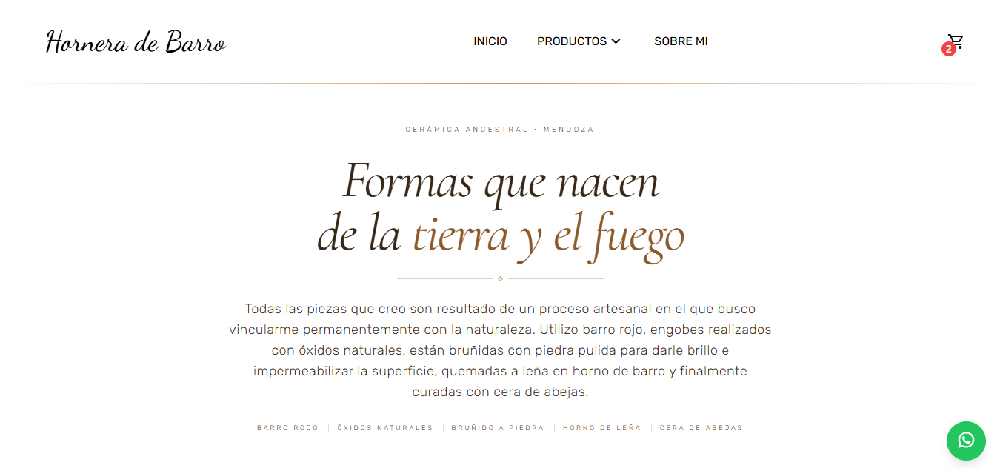
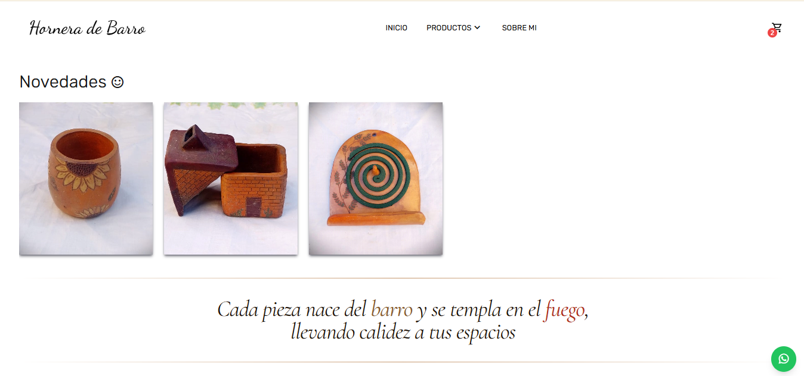
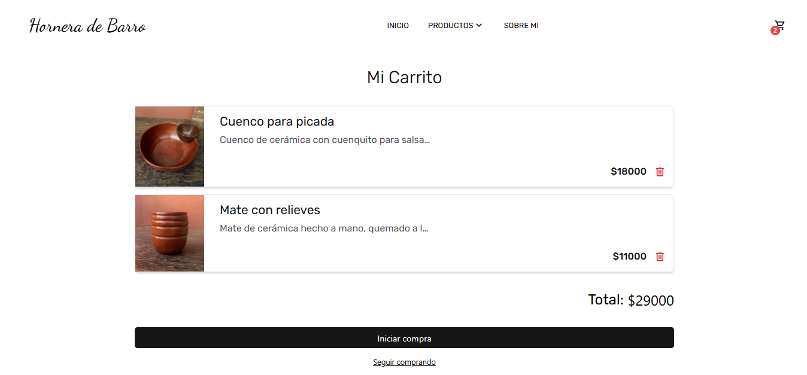
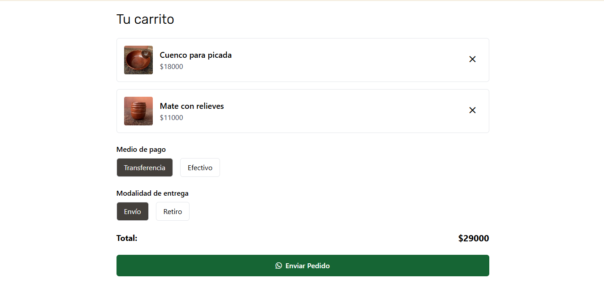
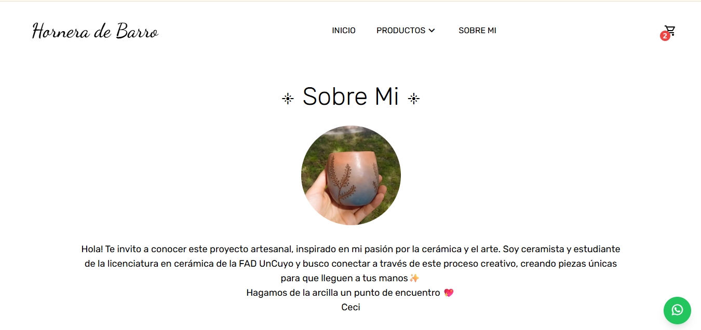

> ⚠️ Este proyecto está actualmente en desarrollo activo. Algunas funcionalidades pueden estar incompletas o sujetas a cambios.
# Hornera de Barro - Emprendimiento de Cerámica artesanal

Catálogo digital con carrito de compras vía WhatsApp para un emprendimiento de cerámica artesanal.

---

## Descripción

 Aplicación web fullstack desarrollada de forma independiente con el stack MERN + TypeScript que funciona como **catálogo digital con carrito social**, donde los clientes pueden explorar productos, armar su pedido y enviarlo directamente al vendedor por WhatsApp.

El vendedor dispone de un **panel de administración privado** desde donde gestiona el catálogo completo de productos.

---

## Funcionalidades

### Para el cliente
- Exploración de productos organizados por categorías
- Barra de búsqueda
- Vista detallada de cada producto con imagen, descripción y precio
- Carrito de compras con suma total en tiempo real
- Envío del pedido al vendedor por WhatsApp (con lista de productos, precios y total)

### Para el administrador (vendedor)
- Login privado con autenticación JWT
- CRUD de productos
- Carga de imágenes de productos con almacenamiento en Cloudinary
- Panel de gestión protegido por ruta privada

---

## Tecnologías utilizadas

### Frontend
- React + TypeScript: UI y tipado estático
- Tailwind CSS: Estilos y diseño responsivo              
- React Router: Navegación y rutas protegidas            
- Zustand: Manejo de estado global (carrito, auth)  
- Axios: Comunicación con la API REST             

### Backend 
 Node.js + Express: Servidor y API REST                    
 MongoDB + Mongoose: Base de datos y modelado de datos     
 JWT: Autenticación del administrador 
 
 GH Link: https://github.com/SophieRF/WebHorneraDeBarro-back.git

### Servicios externos
 Cloudinary: Almacenamiento de imágenes   
 WhatsApp API (WhatsApp Click-to-Chat):  Envío del carrito al vendedor

## Capturas

---

*Desarrollado por Sofia Ferraro especialmente para Hornera de Barro — cerámica artesanal.*
